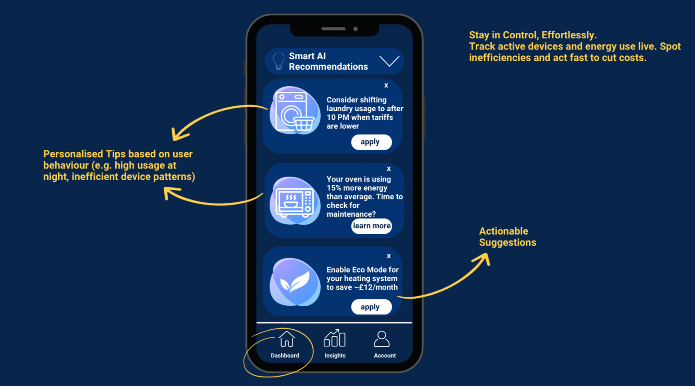
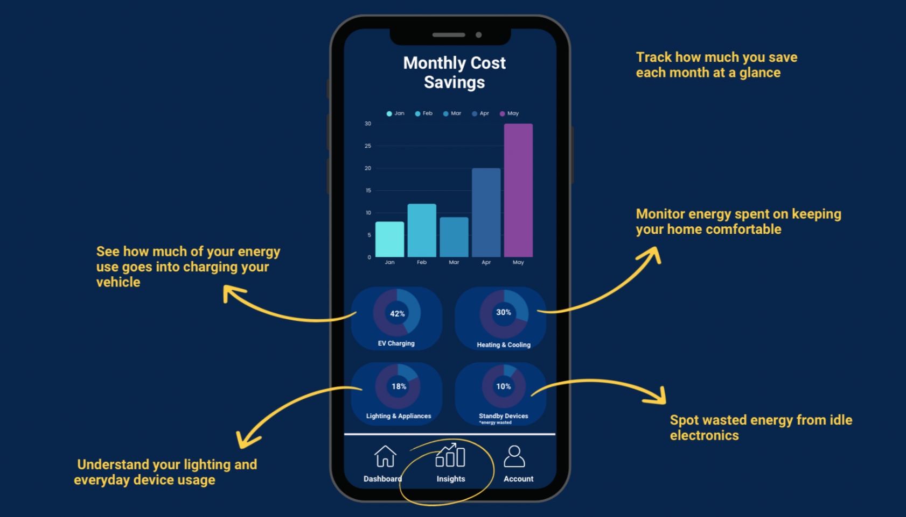

# Startup Development Case: Merit Energy — AI Home Energy Optimisation Platform

Merit Energy is a digital startup concept focused on helping households optimise energy usage and EV charging through AI-driven insights.

The project was developed as part of an MSc in Digital Business and represents a full end-to-end startup journey: from problem discovery and market analysis to product vision, prototype logic, and go-to-market strategy.

> This repository showcases the *thinking, structure, and execution process* behind the project.  
> Sensitive commercial details and full financial models are intentionally excluded.

---

## What This Project Demonstrates

- Product thinking under uncertainty  
- Market and user problem discovery  
- Translation of complex systems into user-friendly solutions  
- Early-stage startup structuring  
- Strategic communication and pitching  

---

## Explore the Project

- 📄 [Product Vision](docs/product-vision.md)  
- 🌍 [Market Context](docs/market-context.md)  
- 👤 [My Role](docs/my-role.md)

---

Merit Energy reflects my ability to operate at the intersection of **strategy, product, and digital execution** — turning abstract problems into structured, buildable solutions.

## Product Preview

Merit Energy is a smart home energy optimisation platform designed for EV owners.  
It combines real-time data, AI recommendations, and intuitive dashboards to help users reduce costs, optimise charging, and lower their carbon footprint.

Below are selected interface concepts demonstrating the core product vision.

### Smart AI Recommendations

Personalised, actionable suggestions based on real usage patterns and tariff dynamics.

### Insights & Energy Breakdown

Clear visibility of where energy is spent — EV charging, heating, lighting, and idle devices.

### Real-Time Dashboard

Live pricing, cost forecasting, carbon impact, and automated charge planning in one place.

> The full business model, financial projections, and go-to-market strategy are documented in the project report and can be shared upon request.
